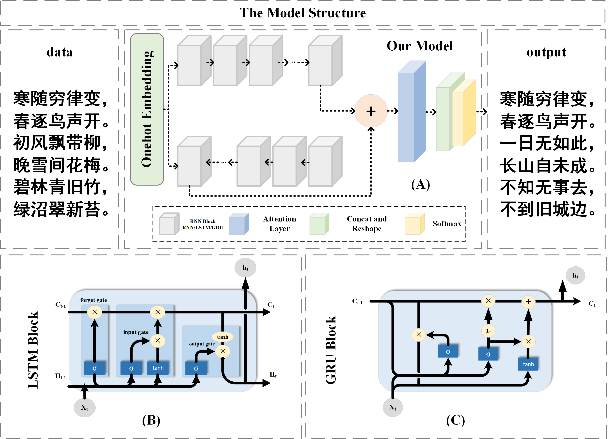

# NLP-PoetryModels
From RNN to GRU and LSTM: A Study on the Performance of Poem Generation Models Integrating Bidirectional and Attention Techniques

- [简体中文](./docs/README-cn.md)
- [English](./README.md)

<div align="center">

## From RNN to GRU and LSTM: A Study on the Performance of Poem Generation Models Integrating Bidirectional and Attention Techniques
[📄[Document](https://github.com/ffengc/NLP-PoetryModels/blob/main/README.md)] &emsp; [💻[Platform](https://www.tensorflow.org)] &emsp; <br>
[🌅[Code](https://github.com/ffengc/NLP-PoetryModels/)] &emsp; [📖[Article(comming soon)](https://github.com/ffengc/NLP-PoetryModels/docs/article.pdf)] &emsp;<br>


</div>

***

- [NLP-PoetryModels](#nlp-poetrymodels)
  - [From RNN to GRU and LSTM: A Study on the Performance of Poem Generation Models Integrating Bidirectional and Attention Techniques](#from-rnn-to-gru-and-lstm-a-study-on-the-performance-of-poem-generation-models-integrating-bidirectional-and-attention-techniques)
  - [Abstract](#abstract)
  - [Environment Setup and how to run this project](#environment-setup-and-how-to-run-this-project)
  - [Model Structure](#model-structure)
  - [Training Results](#training-results)
  - [Chinese Poem Generation Quality Assessment](#chinese-poem-generation-quality-assessment)
    - [BERT-CCPoem](#bert-ccpoem)
    - [Manual Evaluation Rules](#manual-evaluation-rules)
  - [Test Results](#test-results)
  - [Result Generation Examples](#result-generation-examples)
  - [Citations](#citations)

***

## Abstract

By delving deep into the poem generation model CharRNN, we experimented with three core modules: LSTM, RNN, and GRU, and introduced variants of the attention mechanism and bidirectional network structure. Experiments involved multiple datasets, including Chinese poems, English articles, Chinese song lyrics, Japanese articles, and Linux script languages, with the Chinese poem dataset utilizing all model variants, while other datasets were trained using only the LSTM model. The effects were tested using Tsinghua University's AI Institute's NLP and Society and Humanities Computing Research Center's BERT-CCPoem automatic evaluation system and manual scoring method. Results show that the basic LSTM and GRU models performed well in the poem generation task, while the introduced attention mechanism and bidirectional structure reduced training efficiency and increased loss, but did not show significant improvement in the quality of generated poems. The findings of this study provide new perspectives and empirical bases for the application of deep learning in the field of artistic creation.

## Environment Setup and how to run this project

- **[run.md](./docs/run-en.md)**

## Model Structure



## Training Results


## Chinese Poem Generation Quality Assessment

Details can be found in the article.

### BERT-CCPoem

cite from: [https://github.com/THUNLP-AIPoet/BERT-CCPoem](https://github.com/THUNLP-AIPoet/BERT-CCPoem)

The BERT_CCPoem model is based on the BERT architecture, specifically optimized for the semantic understanding of Chinese classical poetry texts. BERT's bidirectional training mechanism allows the model to consider the information before and after a word when representing it, thereby obtaining a richer and more accurate semantic representation of each word. This deep bidirectional representation is essential for understanding poetry, a text form with complex structure and rich semantics, as the language of poetry often contains multiple layers of imagery and metaphors.

### Manual Evaluation Rules

In assessing the performance of the poem generation models, a manual evaluation method was used, setting three main indicators (all with a maximum score of 5 points): grammatical correctness, clarity of expression, and thematic coherence. Grammatical correctness mainly assesses whether the structure and word count of the poem are aligned, accounting for 0.6 of the total score. Clarity of expression assesses whether readers can clearly understand the meaning of the verses, accounting for 0.25 of the total score. Thematic coherence checks whether the theme of the entire poem is consistent, accounting for 0.15 of the total score. These three indicators collectively determine the overall quality of the poems generated by the model.

<div align="center">

| Evaluation Indicator | Weight |
|-------|-------|
| Grammatical Correctness | 0.60 |
| Clarity of Expression | 0.25 |
| Thematic Coherence | 0.15 |

</div>

The final score consists of 50% machine scoring and 50% manual scoring.

## Test Results

<div align="center">

| Model                  | Score (out of 100) |
|----------------------|-----------------|
| `lstm`               | 92.59           |
| `lstm+attention`     | 58.88           |
| `bi-lstm`            | 51.30           |
| `bi-lstm+attention`  | 58.68           |
| `rnn`                | 96.90           |
| `rnn+attention`      | 77.70           |
| `bi-rnn`             | 26.00           |
| `bi-rnn+attention`   | 29.41           |
| `gru`                | 98.41           |
| `gru+attention`      | 17.70           |
| `bi-gru`             | 32.80           |
| `bi-gru+attention`   | 26.00           |

</div>

**Best Performing GRU Model:** The standalone GRU model scored the highest at 98.41 points. This indicates that the GRU structure is very effective for this specific poem generation task.

**RNN Also Performs Well:** The pure RNN model scored the second highest at 96.90 points, demonstrating the powerful capability of RNNs in handling text generation tasks.

**LSTM Scores High but Unstable:** The LSTM model itself performed well with a score of 92.59. However, when the attention mechanism was added, the score significantly dropped to 58.88.

**Most Models Score Lower with Added Attention Mechanism:** Except for RNN, most models scored lower after the addition of the attention mechanism. Especially for the GRU model, the score plummeted from 98.41 to 17.70 after adding attention.

**Bidirectional Models Perform Poorly:** All bidirectional models (bi-LSTM, bi-RNN, bi-GRU) scored generally low, mostly below 30, regardless of whether attention was added. This may indicate that the bidirectional structure may not be the optimal choice for this type of generation task.

**Summary:** Simple GRU and RNN models demonstrated high effectiveness in this poetry generation task, while bidirectional structures and models with added attention generally performed poorly. This information can guide future model selection and optimization.

## Result Generation Examples

cite from: [https://github.com/wandouduoduo/SunRnn](https://github.com/wandouduoduo/SunRnn)

Generate English articles:

```
BROTON:
When thou art at to she we stood those to that hath
think they treaching heart to my horse, and as some trousting.

LAUNCE:
The formity so mistalied on his, thou hast she was
to her hears, what we shall be that say a soun man
Would the lord and all a fouls and too, the say,
That we destent and here with my peace.

PALINA:
Why, are the must thou art breath or thy saming,
I have sate it him with too to have me of
I the camples.
```

Generate Chinese poems:

```
何人无不见，此地自何如。
一夜山边去，江山一夜归。
山风春草色，秋水夜声深。
何事同相见，应知旧子人。
何当不相见，何处见江边。
一叶生云里，春风出竹堂。
何时有相访，不得在君心。
```

Generate Chinese articles:

```
闻言，萧炎一怔，旋即目光转向一旁的那名灰袍青年，然后目光在那位老者身上扫过，那里，一个巨大的石台上，有着一个巨大的巨坑，一些黑色光柱，正在从中，一道巨大的黑色巨蟒，一股极度恐怖的气息，从天空上暴射而出 ，然后在其中一些一道道目光中，闪电般的出现在了那些人影，在那种灵魂之中，却是有着许些强者的感觉，在他们面前，那一道道身影，却是如同一道黑影一般，在那一道道目光中，在这片天地间，在那巨大的空间中，弥漫而开……

“这是一位斗尊阶别，不过不管你，也不可能会出手，那些家伙，可以为了这里，这里也是能够有着一些异常，而且他，也是不能将其他人给你的灵魂，所以，这些事，我也是不可能将这一个人的强者给吞天蟒，这般一次，我们的实力，便是能够将之击杀……”

“这里的人，也是能够与魂殿强者抗衡。”

萧炎眼眸中也是掠过一抹惊骇，旋即一笑，旋即一声冷喝，身后那些魂殿殿主便是对于萧炎，一道冷喝的身体，在天空之上暴射而出，一股恐怖的劲气，便是从天空倾洒而下。

“嗤！”
```

Generate Chinese song lyrics:

```
我知道
我的世界 一种解
我一直实现 语不是我
有什么(客) 我只是一口
我想想我不来 你的微笑
我说 你我你的你
只能有我 一个梦的
我说的我的
我不能再想
我的爱的手 一点有美
我们 你的我 你不会再会爱不到
```

Generate code:

```
static int test_trace_task(struct rq *rq)
{
        read_user_cur_task(state);
        return trace_seq;
}

static int page_cpus(struct flags *str)
{
        int rc;
        struct rq *do_init;
};

/*
 * Core_trace_periods the time in is is that supsed,
 */
#endif

/*
 * Intendifint to state anded.
 */
int print_init(struct priority *rt)
{       /* Comment sighind if see task so and the sections */
        console(string, &can);
}
```

Generate Japanese articles:

```
「ああ、それだ、」とお夏は、と夏のその、
「そうだっていると、お夏は、このお夏が、その時、
（あ、」
　と声にはお夏が、これは、この膝の方を引寄って、お夏に、
「まあ。」と、その時のお庇《おも》ながら、
```

## Citations

**BERT-CCPoem: [https://github.com/THUNLP-AIPoet/BERT-CCPoem](https://github.com/THUNLP-AIPoet/BERT-CCPoem)**

**SunRnn: [https://github.com/wandouduoduo/SunRnn](https://github.com/wandouduoduo/SunRnn)** Part of my code structure comes from this repository.
