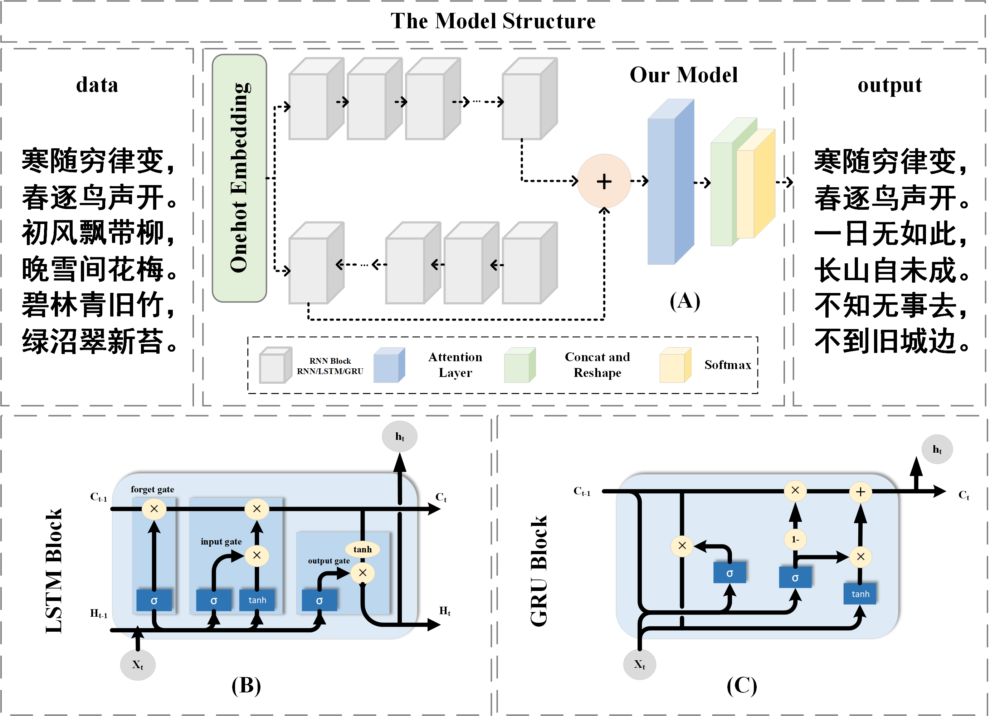
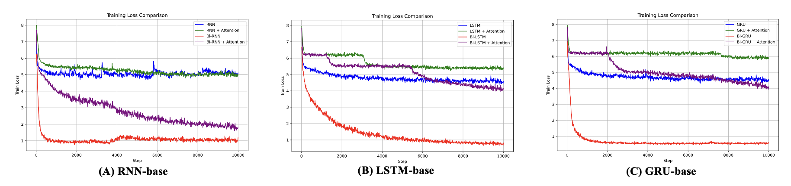

# NLP-PoetryModels
从 RNN 到 GRU 与 LSTM:综合双向及注意力技术的诗歌生成模型性能研究

- [简体中文](./README-cn.md)
- [English](../README.md)

<div align="center">

## 从RNN到GRU与LSTM:综合双向及注意力技术的诗歌生成模型性能研究
[📄[Document](https://github.com/ffengc/NLP-PoetryModels/blob/main/README.md)] &emsp; [💻[Platform](https://www.tensorflow.org)] &emsp; <br>
[🌅[Code](https://github.com/ffengc/NLP-PoetryModels/)] &emsp; [📖[Article](https://github.com/ffengc/NLP-PoetryModels/docs/article.pdf)] &emsp;<br>

</div>

***

- [NLP-PoetryModels](#nlp-poetrymodels)
  - [从RNN到GRU与LSTM:综合双向及注意力技术的诗歌生成模型性能研究](#从rnn到gru与lstm综合双向及注意力技术的诗歌生成模型性能研究)
  - [摘要](#摘要)
  - [环境搭建和运行方法](#环境搭建和运行方法)
  - [模型结构](#模型结构)
  - [训练结果](#训练结果)
  - [中文诗歌生成质量评估](#中文诗歌生成质量评估)
    - [BERT-CCPoem](#bert-ccpoem)
    - [人工评估规则](#人工评估规则)
  - [测试结果](#测试结果)
  - [结果生成示例](#结果生成示例)
  - [引用](#引用)

***

## 摘要

通过对诗歌生成模型 CharRNN 进行深入探讨，实验了三种核心模块：LSTM、RNN 和 GRU，并在此基础上引入了注意力机制和双向网络结构的变体。实验涉及多个数据集，包括中 文诗歌、英文文章、中文歌词、日语文章和 Linux 脚本语言，其中中文诗歌数据集应用了所有模型变体，其他数据集仅使 用 LSTM 模型进行训练。通过清华大学人工智能研究院自然语言处理与社会人文计算研究中心的 BERT-CCPoem 自动评估系统及人工打分法进行效果测试。结果显示，基础的 LSTM 和 GRU 模型在诗歌生成任务上表现良好，而引入的注意力机 制和双向结构虽降低了训练效率且增加了 loss，但在生成诗歌的质量上并未见明显提升。本研究的发现为深度学习在艺 术创作领域的应用提供了新的视角和实证基础。

## 环境搭建和运行方法

- **[run.md](./run-cn.md)**

## 模型结构



## 训练结果



## 中文诗歌生成质量评估

本部分细节可见文章。

### BERT-CCPoem

cite from: [https://github.com/THUNLP-AIPoet/BERT-CCPoem](https://github.com/THUNLP-AIPoet/BERT-CCPoem)

BERT_CCPoem 模型基于 BERT 架构，专门针对中文古诗文本的语义理解进行了优化。BERT 的双向训练 机制允许模型在进行词语的表示时，同时考虑其前后文的信息，从而获得每个词语更加丰富和准确的语义信息。这种深度双向表示是理解诗歌这种文本结构复杂、语义丰富的文体所必需的，因为诗歌的语言表达通常包含多层次的意象和隐喻。

### 人工评估规则

在评估诗歌生成模型的性能时，采用了人工评估方法，并设置了三个主要指标(满分都为 5 分):语法正确性、表 达清晰度和主题连贯性。语法正确性主要评估诗歌的结构和 字数是否对齐，占总评分的 0.6。表达清晰度评估读者能否清晰理解诗句的意思，占总评分的 0.25。主题连贯性则检查 整首诗的主题是否连贯一致，占总评分的 0.15。这三个指标 综合决定了模型生成的诗歌的整体质量。

<div align="center">

| 评估指标 | 权重 |
|-------|-------|
| 语法正确 | 0.60 |
| 表达清晰度 | 0.25 |
| 主题连贯性 | 0.15 |

</div>

最后得分由机器评分和人工评分各占50%构成。

## 测试结果

<div align="center">

| 模型                  | 得分(满分为100分) |
|----------------------|-----------------|
| `lstm`               | 92.59           |
| `lstm+attention`     | 58.88           |
| `bi-lstm`            | 51.30           |
| `bi-lstm+attention`  | 58.68           |
| `rnn`                | 96.90           |
| `rnn+attention`      | 77.70           |
| `bi-rnn`             | 26.00           |
| `bi-rnn+attention`   | 29.41           |
| `gru`                | 98.41           |
| `gru+attention`      | 17.70           |
| `bi-gru`             | 32.80           |
| `bi-gru+attention`   | 26.00           |

</div>

**GRU模型表现最优：** 单独的GRU模型得到了最高分，为98.41分。这表明在这个特定的诗歌生成任务中，GRU结构非常有效。

**RNN同样表现良好：** 纯RNN模型得到了第二高的得分，为96.90分。这也显示了RNN在处理文本生成任务时的强大能力。

**LSTM的得分较高但不稳定：** LSTM模型本身表现不错，得分为92.59分。然而，当添加attention机制后，得分显著下降到58.88分。

**加入Attention机制后多数模型得分下降：** 除了RNN外，大部分模型在加入attention机制后得分有所下降。特别是GRU模型，加入attention后得分从98.41分骤降至17.70分。

**双向模型表现不佳：** 所有双向模型（bi-LSTM, bi-RNN, bi-GRU）不论是否加入attention，得分普遍较低，大多低于30分。这可能表明在这种类型的生成任务中，双向结构可能不是最优选择。

**总结：** 简单的GRU和RNN模型在这项诗歌生成任务中表现出了较高的有效性，而双向结构和添加了attention的模型则在大多数情况下表现不佳。这些信息可以为未来的模型选择和优化提供指导。

## 结果生成示例

cite from: [https://github.com/wandouduoduo/SunRnn](https://github.com/wandouduoduo/SunRnn)

生成英文文章：

```
BROTON:
When thou art at to she we stood those to that hath
think they treaching heart to my horse, and as some trousting.

LAUNCE:
The formity so mistalied on his, thou hast she was
to her hears, what we shall be that say a soun man
Would the lord and all a fouls and too, the say,
That we destent and here with my peace.

PALINA:
Why, are the must thou art breath or thy saming,
I have sate it him with too to have me of
I the camples.
```

生成中文诗歌：

```
何人无不见，此地自何如。
一夜山边去，江山一夜归。
山风春草色，秋水夜声深。
何事同相见，应知旧子人。
何当不相见，何处见江边。
一叶生云里，春风出竹堂。
何时有相访，不得在君心。
```

生成中文文章：

```
闻言，萧炎一怔，旋即目光转向一旁的那名灰袍青年，然后目光在那位老者身上扫过，那里，一个巨大的石台上，有着一个巨大的巨坑，一些黑色光柱，正在从中，一道巨大的黑色巨蟒，一股极度恐怖的气息，从天空上暴射而出 ，然后在其中一些一道道目光中，闪电般的出现在了那些人影，在那种灵魂之中，却是有着许些强者的感觉，在他们面前，那一道道身影，却是如同一道黑影一般，在那一道道目光中，在这片天地间，在那巨大的空间中，弥漫而开……

“这是一位斗尊阶别，不过不管你，也不可能会出手，那些家伙，可以为了这里，这里也是能够有着一些异常，而且他，也是不能将其他人给你的灵魂，所以，这些事，我也是不可能将这一个人的强者给吞天蟒，这般一次，我们的实力，便是能够将之击杀……”

“这里的人，也是能够与魂殿强者抗衡。”

萧炎眼眸中也是掠过一抹惊骇，旋即一笑，旋即一声冷喝，身后那些魂殿殿主便是对于萧炎，一道冷喝的身体，在天空之上暴射而出，一股恐怖的劲气，便是从天空倾洒而下。

“嗤！”
```

生成中文歌词：

```
我知道
我的世界 一种解
我一直实现 语不是我
有什么(客) 我只是一口
我想想我不来 你的微笑
我说 你我你的你
只能有我 一个梦的
我说的我的
我不能再想
我的爱的手 一点有美
我们 你的我 你不会再会爱不到
```

生成代码：

```
static int test_trace_task(struct rq *rq)
{
        read_user_cur_task(state);
        return trace_seq;
}

static int page_cpus(struct flags *str)
{
        int rc;
        struct rq *do_init;
};

/*
 * Core_trace_periods the time in is is that supsed,
 */
#endif

/*
 * Intendifint to state anded.
 */
int print_init(struct priority *rt)
{       /* Comment sighind if see task so and the sections */
        console(string, &can);
}
```

生成日语文章：

```
「ああ、それだ、」とお夏は、と夏のその、
「そうだっていると、お夏は、このお夏が、その時、
（あ、」
　と声にはお夏が、これは、この膝の方を引寄って、お夏に、
「まあ。」と、その時のお庇《おも》ながら、
```

## 引用

**BERT-CCPoem: [https://github.com/THUNLP-AIPoet/BERT-CCPoem](https://github.com/THUNLP-AIPoet/BERT-CCPoem)**

**SunRnn: [https://github.com/wandouduoduo/SunRnn](https://github.com/wandouduoduo/SunRnn)** 我的代码部分结构来自于这个仓库